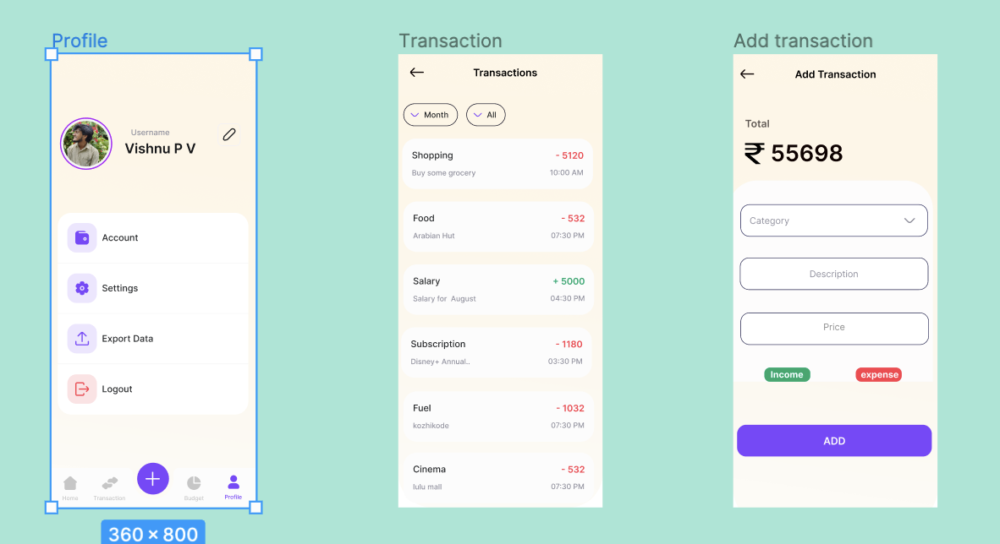

# Task_2

## Thiết kế database cho ứng dụng

## List các tính năng chính của ứng dụng (mô tả tính năng dành cho ai, sử dụng như thế nào)

    1. Tính năng chính
        Quản lý thu chi cá nhân

    2.Đối tượng
        Dành cho người muốn quản lý Thu chi online

    3.Sử dụng

        - Login / Register
        - Home (
            + Số Dư
            + Số Tiền Đã Thêm Trong Tháng
            + Số tiền đã chi
            + 3 Giao dịch gần nhất
            + NavButton
        )
        - Transaction (
            + list spending (Ngay - Thang - Năm)
        )

        -Add transaction (
            + Thêm tiền
            + Tiêu Tiền

        )
        -User(

            + Update TK
            + Setting
            + Logout

        )

    # Mockup giao diện

